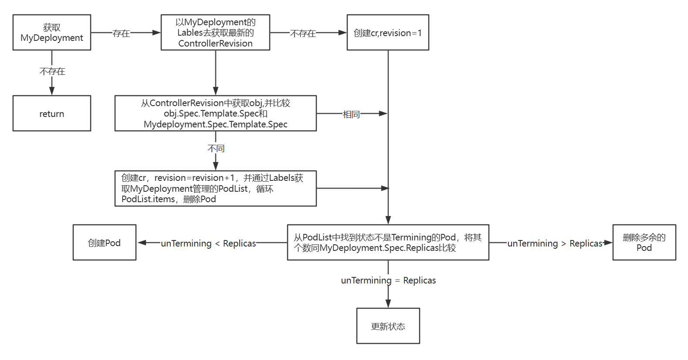

# mydeployment
参考微信公众号码上101，用kubebuilder实现一个自己的deployment，它有以下几个需求

## 需求
1. 不改变deployment的原始定义，和内置的deployment保持一致
2. 绕过replicaset直接创建pod
3. 由于不存在replicaset，它的升级将参考statefulset使用controllerrevision来实现
## Getting Started

### 环境
- go version: go1.22.12 linux/amd64
- minikube version: v1.35.0
- kubernetes version: v1.24.17
- kubebuilder version: 3.14.1.

### 初始化项目
```sh
go mod init github.com/hdssbks/mydeployment
kubebuilder init --domain zq.com --repo github.com/hdssbks/mydeployment
kubebuilder create api --group kubebuilder --version v1beta1 --kind MyDeployment
```

### 修改api/v1beta1/mydeployment_types.go
```go
/*
Copyright 2025.

Licensed under the Apache License, Version 2.0 (the "License");
you may not use this file except in compliance with the License.
You may obtain a copy of the License at

    http://www.apache.org/licenses/LICENSE-2.0

Unless required by applicable law or agreed to in writing, software
distributed under the License is distributed on an "AS IS" BASIS,
WITHOUT WARRANTIES OR CONDITIONS OF ANY KIND, either express or implied.
See the License for the specific language governing permissions and
limitations under the License.
*/

package v1beta1

import (
	appsv1 "k8s.io/api/apps/v1"
	corev1 "k8s.io/api/core/v1"
	metav1 "k8s.io/apimachinery/pkg/apis/meta/v1"
	"k8s.io/apimachinery/pkg/types"
)

// EDIT THIS FILE!  THIS IS SCAFFOLDING FOR YOU TO OWN!
// NOTE: json tags are required.  Any new fields you add must have json tags for the fields to be serialized.

// MyDeploymentSpec defines the desired state of MyDeployment

type ObjectMeta struct {
	// Name must be unique within a namespace. Is required when creating resources, although
	// some resources may allow a client to request the generation of an appropriate name
	// automatically. Name is primarily intended for creation idempotence and configuration
	// definition.
	// Cannot be updated.
	// More info: https://kubernetes.io/docs/concepts/overview/working-with-objects/names#names
	// +optional
	Name string `json:"name,omitempty" protobuf:"bytes,1,opt,name=name"`

	// GenerateName is an optional prefix, used by the server, to generate a unique
	// name ONLY IF the Name field has not been provided.
	// If this field is used, the name returned to the client will be different
	// than the name passed. This value will also be combined with a unique suffix.
	// The provided value has the same validation rules as the Name field,
	// and may be truncated by the length of the suffix required to make the value
	// unique on the server.
	//
	// If this field is specified and the generated name exists, the server will return a 409.
	//
	// Applied only if Name is not specified.
	// More info: https://git.k8s.io/community/contributors/devel/sig-architecture/api-conventions.md#idempotency
	// +optional
	GenerateName string `json:"generateName,omitempty" protobuf:"bytes,2,opt,name=generateName"`

	// Namespace defines the space within which each name must be unique. An empty namespace is
	// equivalent to the "default" namespace, but "default" is the canonical representation.
	// Not all objects are required to be scoped to a namespace - the value of this field for
	// those objects will be empty.
	//
	// Must be a DNS_LABEL.
	// Cannot be updated.
	// More info: https://kubernetes.io/docs/concepts/overview/working-with-objects/namespaces
	// +optional
	Namespace string `json:"namespace,omitempty" protobuf:"bytes,3,opt,name=namespace"`

	// Deprecated: selfLink is a legacy read-only field that is no longer populated by the system.
	// +optional
	SelfLink string `json:"selfLink,omitempty" protobuf:"bytes,4,opt,name=selfLink"`

	// UID is the unique in time and space value for this object. It is typically generated by
	// the server on successful creation of a resource and is not allowed to change on PUT
	// operations.
	//
	// Populated by the system.
	// Read-only.
	// More info: https://kubernetes.io/docs/concepts/overview/working-with-objects/names#uids
	// +optional
	UID types.UID `json:"uid,omitempty" protobuf:"bytes,5,opt,name=uid,casttype=k8s.io/kubernetes/pkg/types.UID"`

	// An opaque value that represents the internal version of this object that can
	// be used by clients to determine when objects have changed. May be used for optimistic
	// concurrency, change detection, and the watch operation on a resource or set of resources.
	// Clients must treat these values as opaque and passed unmodified back to the server.
	// They may only be valid for a particular resource or set of resources.
	//
	// Populated by the system.
	// Read-only.
	// Value must be treated as opaque by clients and .
	// More info: https://git.k8s.io/community/contributors/devel/sig-architecture/api-conventions.md#concurrency-control-and-consistency
	// +optional
	ResourceVersion string `json:"resourceVersion,omitempty" protobuf:"bytes,6,opt,name=resourceVersion"`

	// A sequence number representing a specific generation of the desired state.
	// Populated by the system. Read-only.
	// +optional
	Generation int64 `json:"generation,omitempty" protobuf:"varint,7,opt,name=generation"`

	// CreationTimestamp is a timestamp representing the server time when this object was
	// created. It is not guaranteed to be set in happens-before order across separate operations.
	// Clients may not set this value. It is represented in RFC3339 form and is in UTC.
	//
	// Populated by the system.
	// Read-only.
	// Null for lists.
	// More info: https://git.k8s.io/community/contributors/devel/sig-architecture/api-conventions.md#metadata
	// +optional
	CreationTimestamp metav1.Time `json:"creationTimestamp,omitempty" protobuf:"bytes,8,opt,name=creationTimestamp"`

	// DeletionTimestamp is RFC 3339 date and time at which this resource will be deleted. This
	// field is set by the server when a graceful deletion is requested by the user, and is not
	// directly settable by a client. The resource is expected to be deleted (no longer visible
	// from resource lists, and not reachable by name) after the time in this field, once the
	// finalizers list is empty. As long as the finalizers list contains items, deletion is blocked.
	// Once the deletionTimestamp is set, this value may not be unset or be set further into the
	// future, although it may be shortened or the resource may be deleted prior to this time.
	// For example, a user may request that a pod is deleted in 30 seconds. The Kubelet will react
	// by sending a graceful termination signal to the containers in the pod. After that 30 seconds,
	// the Kubelet will send a hard termination signal (SIGKILL) to the container and after cleanup,
	// remove the pod from the API. In the presence of network partitions, this object may still
	// exist after this timestamp, until an administrator or automated process can determine the
	// resource is fully terminated.
	// If not set, graceful deletion of the object has not been requested.
	//
	// Populated by the system when a graceful deletion is requested.
	// Read-only.
	// More info: https://git.k8s.io/community/contributors/devel/sig-architecture/api-conventions.md#metadata
	// +optional
	DeletionTimestamp *metav1.Time `json:"deletionTimestamp,omitempty" protobuf:"bytes,9,opt,name=deletionTimestamp"`

	// Number of seconds allowed for this object to gracefully terminate before
	// it will be removed from the system. Only set when deletionTimestamp is also set.
	// May only be shortened.
	// Read-only.
	// +optional
	DeletionGracePeriodSeconds *int64 `json:"deletionGracePeriodSeconds,omitempty" protobuf:"varint,10,opt,name=deletionGracePeriodSeconds"`

	// Map of string keys and values that can be used to organize and categorize
	// (scope and select) objects. May match selectors of replication controllers
	// and services.
	// More info: https://kubernetes.io/docs/concepts/overview/working-with-objects/labels
	// +optional
	Labels map[string]string `json:"labels,omitempty" protobuf:"bytes,11,rep,name=labels"`

	// Annotations is an unstructured key value map stored with a resource that may be
	// set by external tools to store and retrieve arbitrary metadata. They are not
	// queryable and should be preserved when modifying objects.
	// More info: https://kubernetes.io/docs/concepts/overview/working-with-objects/annotations
	// +optional
	Annotations map[string]string `json:"annotations,omitempty" protobuf:"bytes,12,rep,name=annotations"`

	// List of objects depended by this object. If ALL objects in the list have
	// been deleted, this object will be garbage collected. If this object is managed by a controller,
	// then an entry in this list will point to this controller, with the controller field set to true.
	// There cannot be more than one managing controller.
	// +optional
	// +patchMergeKey=uid
	// +patchStrategy=merge
	OwnerReferences []metav1.OwnerReference `json:"ownerReferences,omitempty" patchStrategy:"merge" patchMergeKey:"uid" protobuf:"bytes,13,rep,name=ownerReferences"`

	// Must be empty before the object is deleted from the registry. Each entry
	// is an identifier for the responsible component that will remove the entry
	// from the list. If the deletionTimestamp of the object is non-nil, entries
	// in this list can only be removed.
	// Finalizers may be processed and removed in any order.  Order is NOT enforced
	// because it introduces significant risk of stuck finalizers.
	// finalizers is a shared field, any actor with permission can reorder it.
	// If the finalizer list is processed in order, then this can lead to a situation
	// in which the component responsible for the first finalizer in the list is
	// waiting for a signal (field value, external system, or other) produced by a
	// component responsible for a finalizer later in the list, resulting in a deadlock.
	// Without enforced ordering finalizers are free to order amongst themselves and
	// are not vulnerable to ordering changes in the list.
	// +optional
	// +patchStrategy=merge
	Finalizers []string `json:"finalizers,omitempty" patchStrategy:"merge" protobuf:"bytes,14,rep,name=finalizers"`

	// Tombstone: ClusterName was a legacy field that was always cleared by
	// the system and never used.
	// ClusterName string `json:"clusterName,omitempty" protobuf:"bytes,15,opt,name=clusterName"`

	// ManagedFields maps workflow-id and version to the set of fields
	// that are managed by that workflow. This is mostly for internal
	// housekeeping, and users typically shouldn't need to set or
	// understand this field. A workflow can be the user's name, a
	// controller's name, or the name of a specific apply path like
	// "ci-cd". The set of fields is always in the version that the
	// workflow used when modifying the object.
	//
	// +optional
	ManagedFields []metav1.ManagedFieldsEntry `json:"managedFields,omitempty" protobuf:"bytes,17,rep,name=managedFields"`
}
type PodTemplateSpec struct {
	// Standard object's metadata.
	// More info: https://git.k8s.io/community/contributors/devel/sig-architecture/api-conventions.md#metadata
	// +optional
	ObjectMeta `json:"metadata,omitempty" protobuf:"bytes,1,opt,name=metadata"`

	// Specification of the desired behavior of the pod.
	// More info: https://git.k8s.io/community/contributors/devel/sig-architecture/api-conventions.md#spec-and-status
	// +optional
	Spec corev1.PodSpec `json:"spec,omitempty" protobuf:"bytes,2,opt,name=spec"`
}

type MyDeploymentSpec struct {
	// Number of desired pods. This is a pointer to distinguish between explicit
	// zero and not specified. Defaults to 1.
	// +optional
	Replicas *int32 `json:"replicas,omitempty" protobuf:"varint,1,opt,name=replicas"`

	// Label selector for pods. Existing ReplicaSets whose pods are
	// selected by this will be the ones affected by this deployment.
	// It must match the pod template's labels.
	Selector *metav1.LabelSelector `json:"selector" protobuf:"bytes,2,opt,name=selector"`

	// Template describes the pods that will be created.
	// The only allowed template.spec.restartPolicy value is "Always".
	Template PodTemplateSpec `json:"template" protobuf:"bytes,3,opt,name=template"`

	// The deployment strategy to use to replace existing pods with new ones.
	// +optional
	// +patchStrategy=retainKeys
	Strategy appsv1.DeploymentStrategy `json:"strategy,omitempty" patchStrategy:"retainKeys" protobuf:"bytes,4,opt,name=strategy"`

	// Minimum number of seconds for which a newly created pod should be ready
	// without any of its container crashing, for it to be considered available.
	// Defaults to 0 (pod will be considered available as soon as it is ready)
	// +optional
	MinReadySeconds int32 `json:"minReadySeconds,omitempty" protobuf:"varint,5,opt,name=minReadySeconds"`

	// The number of old ReplicaSets to retain to allow rollback.
	// This is a pointer to distinguish between explicit zero and not specified.
	// Defaults to 10.
	// +optional
	RevisionHistoryLimit *int32 `json:"revisionHistoryLimit,omitempty" protobuf:"varint,6,opt,name=revisionHistoryLimit"`

	// Indicates that the deployment is paused.
	// +optional
	Paused bool `json:"paused,omitempty" protobuf:"varint,7,opt,name=paused"`

	// The maximum time in seconds for a deployment to make progress before it
	// is considered to be failed. The deployment controller will continue to
	// process failed deployments and a condition with a ProgressDeadlineExceeded
	// reason will be surfaced in the deployment status. Note that progress will
	// not be estimated during the time a deployment is paused. Defaults to 600s.
	ProgressDeadlineSeconds *int32 `json:"progressDeadlineSeconds,omitempty" protobuf:"varint,9,opt,name=progressDeadlineSeconds"`
}

// MyDeploymentStatus defines the observed state of MyDeployment
type MyDeploymentStatus struct {
	// INSERT ADDITIONAL STATUS FIELD - define observed state of cluster
	// Important: Run "make" to regenerate code after modifying this file
	// observedGeneration is the most recent generation observed for this StatefulSet. It corresponds to the
	// StatefulSet's generation, which is updated on mutation by the API Server.
	// +optional
	ObservedGeneration int64 `json:"observedGeneration,omitempty" protobuf:"varint,1,opt,name=observedGeneration"`

	// replicas is the number of Pods created by the StatefulSet controller.
	Replicas int32 `json:"replicas" protobuf:"varint,2,opt,name=replicas"`

	// readyReplicas is the number of pods created for this StatefulSet with a Ready Condition.
	ReadyReplicas int32 `json:"readyReplicas,omitempty" protobuf:"varint,3,opt,name=readyReplicas"`

	// currentReplicas is the number of Pods created by the StatefulSet controller from the StatefulSet version
	// indicated by currentRevision.
	CurrentReplicas int32 `json:"currentReplicas,omitempty" protobuf:"varint,4,opt,name=currentReplicas"`

	// updatedReplicas is the number of Pods created by the StatefulSet controller from the StatefulSet version
	// indicated by updateRevision.
	UpdatedReplicas int32 `json:"updatedReplicas,omitempty" protobuf:"varint,5,opt,name=updatedReplicas"`

	// currentRevision, if not empty, indicates the version of the StatefulSet used to generate Pods in the
	// sequence [0,currentReplicas).
	CurrentRevision string `json:"currentRevision,omitempty" protobuf:"bytes,6,opt,name=currentRevision"`

	// updateRevision, if not empty, indicates the version of the StatefulSet used to generate Pods in the sequence
	// [replicas-updatedReplicas,replicas)
	UpdateRevision string `json:"updateRevision,omitempty" protobuf:"bytes,7,opt,name=updateRevision"`

	// collisionCount is the count of hash collisions for the StatefulSet. The StatefulSet controller
	// uses this field as a collision avoidance mechanism when it needs to create the name for the
	// newest ControllerRevision.
	// +optional
	CollisionCount *int32 `json:"collisionCount,omitempty" protobuf:"varint,9,opt,name=collisionCount"`

	// Represents the latest available observations of a statefulset's current state.
	// +optional
	// +patchMergeKey=type
	// +patchStrategy=merge
	Conditions []appsv1.StatefulSetCondition `json:"conditions,omitempty" patchStrategy:"merge" patchMergeKey:"type" protobuf:"bytes,10,rep,name=conditions"`

	// Total number of available pods (ready for at least minReadySeconds) targeted by this statefulset.
	// +optional
	AvailableReplicas int32 `json:"availableReplicas" protobuf:"varint,11,opt,name=availableReplicas"`
}

//+kubebuilder:object:root=true
//+kubebuilder:subresource:status

// MyDeployment is the Schema for the mydeployments API
type MyDeployment struct {
	metav1.TypeMeta   `json:",inline"`
	metav1.ObjectMeta `json:"metadata,omitempty"`

	Spec   MyDeploymentSpec   `json:"spec,omitempty"`
	Status MyDeploymentStatus `json:"status,omitempty"`
}

//+kubebuilder:object:root=true

// MyDeploymentList contains a list of MyDeployment
type MyDeploymentList struct {
	metav1.TypeMeta `json:",inline"`
	metav1.ListMeta `json:"metadata,omitempty"`
	Items           []MyDeployment `json:"items"`
}

func init() {
	SchemeBuilder.Register(&MyDeployment{}, &MyDeploymentList{})
}
```
这里会遇到两个问题
1. 在执行make install时会报错metadata.annotations: Too long: must have at most 262144 bytes，修改Makefile，添加:maxDescLen=0，重新执行即可
```makefile
.PHONY: manifests
manifests: controller-gen ## Generate WebhookConfiguration, ClusterRole and CustomResourceDefinition objects.
	$(CONTROLLER_GEN) rbac:roleName=manager-role crd:maxDescLen=0 webhook paths="./..." output:crd:artifacts:config=config/crd/bases
```
2. 这里没有直接引用appsv1.DeploymentSpec和appsv1.StatefulSetStatus的原因是，在apply crd后无法生成某些字段，例如mydeployment.spec.template.metadata，所以选择了拷贝内置Deployment的Spec和StatefulSet的Status
```shell
[root@minikube ~]# kubectl explain mydeployment.spec.template.metadata
KIND:     MyDeployment
VERSION:  kubebuilder.zq.com/v1beta1

DESCRIPTION:
     <empty>
```
执行make generate生成DeepCopy方法
```shell
root@minikube:/home/mydeployment# make generate
/home/mydeployment/bin/controller-gen-v0.14.0 object:headerFile="hack/boilerplate.go.txt" paths="./..."
```

### 调谐逻辑

1. 从缓存中获取MyDeployment，如果err为IsNotFound，表示删除事件，直接返回
2. 如果能获取MyDeployment，从ControllerRevision中获取最大的revision
3. 如果maxRevisionCR为空，表示资源尚未创建ControllerRevision，则创建ControllerRevision，且RevisionID为1
4. 如果maxRevisionCR不为空，则从maxRevisionCR取出object, 比较object.Spec.Template.Spec与从缓存中获取的MyDeployment.Spec.Template.Spec，比较的目的为判断镜像是否改变，副本数的变化不在判断中
5. 如果不相同，则创建新的ControllerRevision，并且RevisionID+1，同时通过Label从缓存中找到MyDeployment管理的PodList，并通过循环PodList.item删除Pod
6. 从循环PodList.Item，找到状态不为Terminating的Pod，比较状态不为Terminating的Pod的数量和MyDeployment.Spec.Replicas
7. 如果不为Terminating的Pod的数量大于MyDeployment.Spec.Replicas，则删除多余的Pod
8. 如果不为Terminating的Pod的数量小于MyDeployment.Spec.Replicas，则创建Pod
9. 如果不为Terminating的Pod的数量等于MyDeployment.Spec.Replicas，则更新状态

### 代码实现
1. 从缓存中获取MyDeployment，如果err为IsNotFound，表示删除事件，直接返回
```go
mydeploy := &kubebuilderv1beta1.MyDeployment{}
if err := r.Get(ctx, req.NamespacedName, mydeploy); err != nil {
    return ctrl.Result{}, client.IgnoreNotFound(err)
}

// 如果deployment暂停，就不会创建删除pod，直接返回
if mydeploy.Spec.Paused {
    return ctrl.Result{}, nil
}
```

2. 如果能获取MyDeployment，从ControllerRevision中获取最大的revision
```go
cr, err := r.getMaxRevision(ctx, mydeploy, listOpts)
if err != nil {
	r.Recorder.Event(mydeploy, corev1.EventTypeWarning, "GetControllerRevision", err.Error())
	return ctrl.Result{}, err
}

// 获取最大的Revision
func (r *MyDeploymentReconciler) getMaxRevision(ctx context.Context, mydeploy *kubebuilderv1beta1.MyDeployment, listOpts client.ListOptions) (*appsv1.ControllerRevision, error) {
	crs := &appsv1.ControllerRevisionList{}
	if err := r.List(ctx, crs, &listOpts); err != nil {
		r.Recorder.Event(mydeploy, corev1.EventTypeWarning, "ListControllerRevision", err.Error())
		return nil, err
	}
	if len(crs.Items) == 0 {
		return nil, nil
	}
	maxRevision := int64(0)
	index := 0
	for i, cr := range crs.Items {
		if cr.Revision > maxRevision {
			maxRevision = cr.Revision
			index = i
		}
	}
	return &crs.Items[index], nil
}
```
3. 如果maxRevisionCR为空，表示资源尚未创建ControllerRevision，则创建ControllerRevision，且RevisionID为1
```go
// 如果cr为空，则创建cr
if cr == nil {
    cr, err = r.createControllerRevision(ctx, mydeploy, 1)
    if err != nil {
        r.Recorder.Event(mydeploy, corev1.EventTypeWarning, "CreateControllerRevision", err.Error())
        return ctrl.Result{}, err
    }
}

// 创建cr
func (r *MyDeploymentReconciler) createControllerRevision(ctx context.Context, mydeploy *kubebuilderv1beta1.MyDeployment, revision int64) (*appsv1.ControllerRevision, error) {
    // 将MyDeployment对象序列化为json
    bytesDeploy, err := json.Marshal(mydeploy)
    if err != nil {
        r.Recorder.Event(mydeploy, corev1.EventTypeWarning, "Unmarshal", err.Error())
        panic(err)
    }

	cr := &appsv1.ControllerRevision{
        ObjectMeta: ctrl.ObjectMeta{
            Namespace: mydeploy.Namespace,
            Name:      mydeploy.Name + "-" + utils.RandStr(5),
            Labels:    mydeploy.Spec.Selector.MatchLabels,
        },
        Data: runtime.RawExtension{
            Raw:    bytesDeploy,
            Object: mydeploy,
        },
        Revision: revision,
    }

	// 设置cr的OwnerReference为MyDeployment
    if err := ctrl.SetControllerReference(mydeploy, cr, r.Scheme); err != nil {
        r.Recorder.Event(mydeploy, corev1.EventTypeWarning, "SetControllerReference", err.Error())
        return nil, err
    }
	
    if err := r.Create(ctx, cr); err != nil {
        r.Recorder.Event(mydeploy, corev1.EventTypeWarning, "CreateControllerRevision", err.Error())
        return nil, err
    }
	
    return cr, nil
}
```
4. 如果maxRevisionCR不为空，则从maxRevisionCR取出object，判断镜像是否改变，如果改变则创建新的CR，并删除所有Pod
```go
// 通过标签找到被MyDeployment管理的pod
pods := &corev1.PodList{}
err = r.List(ctx, pods, &listOpts)
if err != nil {
    r.Recorder.Event(mydeploy, corev1.EventTypeWarning, "GetPods", err.Error())
    return ctrl.Result{}, err
}

// 如果cr不为空，获取cr中的object
obj := &kubebuilderv1beta1.MyDeployment{}
if err := json.Unmarshal(cr.Data.Raw, obj); err != nil {
    r.Recorder.Event(mydeploy, corev1.EventTypeWarning, "Unmarshal", err.Error())
    return ctrl.Result{}, err
}
// 比较object.Spec.Template.Spec和MyDeployment.Spec.Template.Spec，如果不相同，则创建新的cr，并删除所有pod
if !reflect.DeepEqual(obj.Spec.Template.Spec, mydeploy.Spec.Template.Spec) {
	// 创建cr,且revision+1
    if _, err := r.createControllerRevision(ctx, mydeploy, cr.Revision+1); err != nil {
        r.Recorder.Event(mydeploy, corev1.EventTypeWarning, "CreateControllerRevision", err.Error())
        return ctrl.Result{}, err
    }
	// 删除pod
    for _, pod := range pods.Items {
        if err := r.Delete(ctx, &pod); err != nil {
            r.Recorder.Event(&pod, corev1.EventTypeWarning, "Delete Pod", "Delete Pod Failed")
        }
    }
	// 更新状态
    if err := r.updateStatus(ctx, mydeploy, &listOpts, cr); err != nil {
        if apierrors.IsConflict(err) {
            r.Recorder.Event(mydeploy, corev1.EventTypeNormal, "Conflict Requeue", err.Error())
            return ctrl.Result{Requeue: true}, nil
        } else {
            r.Recorder.Event(mydeploy, corev1.EventTypeWarning, "UpdateStatus", err.Error())
            return ctrl.Result{}, err
        }
    }
}
```
5. 从循环PodList.Item，找到状态不为Terminating的Pod，比较状态不为Terminating的Pod的数量和MyDeployment.Spec.Replicas
```go
// 删除中的Pod不参与计算
unTerminatedPods := make([]corev1.Pod, 0, len(pods.Items))
for _, pod := range pods.Items {
    if pod.ObjectMeta.DeletionTimestamp.IsZero() {
        unTerminatedPods = append(unTerminatedPods, pod)
    }
}

// 比较mydeploy.Spec.Replicas和unTerminatedPods中的数量
diff := int(*mydeploy.Spec.Replicas) - len(unTerminatedPods)
```
6. 根据数量的差异，创建/删除Pod
```go
switch {
// spec等于实际，直接返回
case diff == 0:
    if err := r.updateStatus(ctx, mydeploy, &listOpts, cr); err != nil {
        if apierrors.IsConflict(err) {
            r.Recorder.Event(mydeploy, corev1.EventTypeNormal, "Conflict Requeue", err.Error())
            return ctrl.Result{Requeue: true}, nil
        } else {
            r.Recorder.Event(mydeploy, corev1.EventTypeWarning, "UpdateStatus", err.Error())
            return ctrl.Result{}, err
        }
    }
// spec小于实际，删除pod
case diff < 0:
    r.Recorder.Event(mydeploy, corev1.EventTypeNormal, "Diff Pods", "more than spec, delete pods")
    // delete pods
    for i := 0; i < 0-diff; i++ {
        logger.Info(fmt.Sprintf("deleting pod: %s", unTerminatedPods[i].Name))
        if err := r.Delete(ctx, &unTerminatedPods[i]); err != nil {
            r.Recorder.Event(mydeploy, corev1.EventTypeWarning, "DeletePod", err.Error())
            return ctrl.Result{}, err
        }
        r.Recorder.Event(mydeploy, corev1.EventTypeNormal, "DeletePod", fmt.Sprintf("delete pod %s", unTerminatedPods[i].Name))
    }
    if err := r.updateStatus(ctx, mydeploy, &listOpts, cr); err != nil {
        if apierrors.IsConflict(err) {
            r.Recorder.Event(mydeploy, corev1.EventTypeNormal, "Conflict Requeue", err.Error())
            return ctrl.Result{Requeue: true}, nil
        } else {
            r.Recorder.Event(mydeploy, corev1.EventTypeWarning, "UpdateStatus", err.Error())
            return ctrl.Result{}, err
        }
    }

// spec大于实际，创建pod
default:
    r.Recorder.Event(mydeploy, corev1.EventTypeNormal, "Diff Pods", "less than spec, create pods")
    // create pods
    for i := 0; i < diff; i++ {
        pod := utils.NewPod(mydeploy)
        err := ctrl.SetControllerReference(mydeploy, pod, r.Scheme)
        if err != nil {
            r.Recorder.Event(mydeploy, corev1.EventTypeWarning, "SetControllerReference", err.Error())
            return ctrl.Result{}, err
        }
        if err := r.Create(ctx, pod); err != nil {
            r.Recorder.Event(mydeploy, corev1.EventTypeWarning, "CreatePod", err.Error())
            return ctrl.Result{}, err
        }
    }
    if err := r.updateStatus(ctx, mydeploy, &listOpts, cr); err != nil {
        if apierrors.IsConflict(err) {
            r.Recorder.Event(mydeploy, corev1.EventTypeNormal, "Conflict Requeue", err.Error())
            return ctrl.Result{Requeue: true}, nil
        } else {
            r.Recorder.Event(mydeploy, corev1.EventTypeWarning, "UpdateStatus", err.Error())
            return ctrl.Result{}, err
        }
    }
}
return ctrl.Result{}, nil
```
7. 更新状态的方法
```go
func (r *MyDeploymentReconciler) updateStatus(ctx context.Context, deploy *kubebuilderv1beta1.MyDeployment, listOpts *client.ListOptions, cr *appsv1.ControllerRevision) error {
    logger := log.FromContext(ctx)

    // 以matchLables查找mydeploy关联的pod
    pods := &corev1.PodList{}
    if err := r.List(ctx, pods, listOpts); err != nil {
        logger.Error(err, "can not list pods")
        return err
    }

// 在podlist中查找状态为ready的pod
    readyPods := int32(0)
    for _, pod := range pods.Items {
        for _, c := range pod.Status.Conditions {
            if c.Type == corev1.PodReady && c.Status == corev1.ConditionTrue {
                readyPods++
            }
        }
    }

    deploy.Status.CurrentReplicas = int32(len(pods.Items))
    deploy.Status.Replicas = *deploy.Spec.Replicas
    deploy.Status.AvailableReplicas = readyPods
    deploy.Status.ReadyReplicas = readyPods
    deploy.Status.CurrentRevision = cr.Name

    if err := r.Status().Update(ctx, deploy); err != nil {
        //r.Recorder.Event(deploy, corev1.EventTypeWarning, "Status Update", err.Error())
        return err
    }
    return nil
}
```

### 注意事项
1. 在更新MyDeployment的状态时，会触发更新事件，从而再次调谐，由于goroutine的关系，可能会导致resourceVersion过期，报错如下
```shell
Operation cannot be fulfilled on [Resource Kind\Resource Name]: the object has been modified; please apply your changes to the latest version and try again
```
目前我已知的解决方法有两个

- 在SetupWithManager中添加Predicate，不将非Spec更新的事件加入到WorkQueue

```go
func (r *MyDeploymentReconciler) SetupWithManager(mgr ctrl.Manager) error {
	return ctrl.NewControllerManagedBy(mgr).
		For(&kubebuilderv1beta1.MyDeployment{}).
		Owns(&corev1.Pod{}).
		Owns(&appsv1.ControllerRevision{}).
		WithEventFilter(predicate.GenerationChangedPredicate{}).
		Complete(r)
}
```
- 在UpdateStatus报错时，将object重新入队，ElasticSearch的Operator也采取了相同的做法，参考https://zhuanlan.zhihu.com/p/402061389

```go
if err := r.updateStatus(ctx, mydeploy, &listOpts, cr); err != nil {
    if apierrors.IsConflict(err) {
        r.Recorder.Event(mydeploy, corev1.EventTypeNormal, "Conflict Requeue", err.Error())
        return ctrl.Result{Requeue: true}, nil
    } else {
        r.Recorder.Event(mydeploy, corev1.EventTypeWarning, "UpdateStatus", err.Error())
        return ctrl.Result{}, err
    }
}
```
2. 在获取maxRevisionCR时，我最初的写法为
```go
func (r *MyDeploymentReconciler) getMaxRevision(ctx context.Context, mydeploy *kubebuilderv1beta1.MyDeployment, listOpts client.ListOptions) (*appsv1.ControllerRevision, error) {
	crs := &appsv1.ControllerRevisionList{}
	if err := r.List(ctx, crs, &listOpts); err != nil {
		r.Recorder.Event(mydeploy, corev1.EventTypeWarning, "ListControllerRevision", err.Error())
		return nil, err
	}
	if len(crs.Items) == 0 {
		return nil, nil
	}
	maxRevisionCR := &appsv1.ControllerRevision{}
	maxRevision := 0
	for i, cr := range crs.Items {
		if cr.Revision > maxRevision {
			maxRevisionCR = &cr
		}
	}
	return maxRevisionCR, nil
}
```
导致我每次取出的maxRevision都不一样。这是一个初学者常见的循环变量问题，在golang中cr作为循环变量，它的地址始终不变，变的是地址中的值，而非每次循环都会为cr分配新的地址，所以循环结束时&cr始终指向最后一次循环的值。网上的资料表示，这个问题在golang 1.22后解决，我并未验证，在后续的开发应尽量避免取循环变量的地址

### Webhook
这里我们的需求是，MyDeployment.Spec.Selector必须与MyDeployment.Spec.Template.Metadata.Labels相同，如果不同则报错
1. 创建一个validating webhook
```shell
$ kubebuilder create webhook --group kubebuilder --version v1beta1 --kind MyDeployment --programmatic-validation
```
2. 校验逻辑，循环MyDeployment.Spec.Selector.MatchLabels，如果MyDeployment.Spec.Template.ObjectMeta.Labels没有Key，或者Key对应的Value和Selector的不一致，则报错
```go
func (r *MyDeployment) validMyDeployment() error {
	for k, v := range r.Spec.Selector.MatchLabels {
		if v1, ok := r.Spec.Template.ObjectMeta.Labels[k]; !ok || v1 != v {
			return apierrors.NewInvalid(r.GroupVersionKind().GroupKind(), r.Name, field.ErrorList{
				field.Invalid(field.NewPath(".spec.template.metadata.labels"), r.Spec.Template.ObjectMeta.Labels, ".spec.template.metadata.labels must equal with .spec.selector.matchlabels"),
			})
		}
	}
	return nil
}
```
3. 在create和update时调用
```go
// ValidateCreate implements webhook.Validator so a webhook will be registered for the type
func (r *MyDeployment) ValidateCreate() (admission.Warnings, error) {
	mydeploymentlog.Info("validate create", "name", r.Name)

	// TODO(user): fill in your validation logic upon object creation.
	return nil, r.validMyDeployment()
}

// ValidateUpdate implements webhook.Validator so a webhook will be registered for the type
func (r *MyDeployment) ValidateUpdate(old runtime.Object) (admission.Warnings, error) {
	mydeploymentlog.Info("validate update", "name", r.Name)

	// TODO(user): fill in your validation logic upon object update.
	return nil, r.validMyDeployment()
}
```
4. 打开config/default/kustomization.yaml中关于Webhook的配置
```yaml
# Adds namespace to all resources.
namespace: mydeployment-system

# Value of this field is prepended to the
# names of all resources, e.g. a deployment named
# "wordpress" becomes "alices-wordpress".
# Note that it should also match with the prefix (text before '-') of the namespace
# field above.
namePrefix: mydeployment-

# Labels to add to all resources and selectors.
#labels:
#- includeSelectors: true
#  pairs:
#    someName: someValue

resources:
  - ../crd
  - ../rbac
  - ../manager
  # [WEBHOOK] To enable webhook, uncomment all the sections with [WEBHOOK] prefix including the one in
  # crd/kustomization.yaml
  - ../webhook
  # [CERTMANAGER] To enable cert-manager, uncomment all sections with 'CERTMANAGER'. 'WEBHOOK' components are required.
  - ../certmanager
# [PROMETHEUS] To enable prometheus monitor, uncomment all sections with 'PROMETHEUS'.
#- ../prometheus

patches:
  # Protect the /metrics endpoint by putting it behind auth.
  # If you want your controller-manager to expose the /metrics
  # endpoint w/o any authn/z, please comment the following line.
  - path: manager_auth_proxy_patch.yaml

  # [WEBHOOK] To enable webhook, uncomment all the sections with [WEBHOOK] prefix including the one in
  # crd/kustomization.yaml
  - path: manager_webhook_patch.yaml

  # [CERTMANAGER] To enable cert-manager, uncomment all sections with 'CERTMANAGER'.
  # Uncomment 'CERTMANAGER' sections in crd/kustomization.yaml to enable the CA injection in the admission webhooks.
  # 'CERTMANAGER' needs to be enabled to use ca injection
  - path: webhookcainjection_patch.yaml

# [CERTMANAGER] To enable cert-manager, uncomment all sections with 'CERTMANAGER' prefix.
# Uncomment the following replacements to add the cert-manager CA injection annotations
replacements:
  - source: # Add cert-manager annotation to ValidatingWebhookConfiguration, MutatingWebhookConfiguration and CRDs
      kind: Certificate
      group: cert-manager.io
      version: v1
      name: serving-cert # this name should match the one in certificate.yaml
      fieldPath: .metadata.namespace # namespace of the certificate CR
    targets:
      - select:
          kind: ValidatingWebhookConfiguration
        fieldPaths:
          - .metadata.annotations.[cert-manager.io/inject-ca-from]
        options:
          delimiter: '/'
          index: 0
          create: true
      - select:
          kind: MutatingWebhookConfiguration
        fieldPaths:
          - .metadata.annotations.[cert-manager.io/inject-ca-from]
        options:
          delimiter: '/'
          index: 0
          create: true
      - select:
          kind: CustomResourceDefinition
        fieldPaths:
          - .metadata.annotations.[cert-manager.io/inject-ca-from]
        options:
          delimiter: '/'
          index: 0
          create: true
  - source:
      kind: Certificate
      group: cert-manager.io
      version: v1
      name: serving-cert # this name should match the one in certificate.yaml
      fieldPath: .metadata.name
    targets:
      - select:
          kind: ValidatingWebhookConfiguration
        fieldPaths:
          - .metadata.annotations.[cert-manager.io/inject-ca-from]
        options:
          delimiter: '/'
          index: 1
          create: true
      - select:
          kind: MutatingWebhookConfiguration
        fieldPaths:
          - .metadata.annotations.[cert-manager.io/inject-ca-from]
        options:
          delimiter: '/'
          index: 1
          create: true
      - select:
          kind: CustomResourceDefinition
        fieldPaths:
          - .metadata.annotations.[cert-manager.io/inject-ca-from]
        options:
          delimiter: '/'
          index: 1
          create: true
  - source: # Add cert-manager annotation to the webhook Service
      kind: Service
      version: v1
      name: webhook-service
      fieldPath: .metadata.name # namespace of the service
    targets:
      - select:
          kind: Certificate
          group: cert-manager.io
          version: v1
        fieldPaths:
          - .spec.dnsNames.0
          - .spec.dnsNames.1
        options:
          delimiter: '.'
          index: 0
          create: true
  - source:
      kind: Service
      version: v1
      name: webhook-service
      fieldPath: .metadata.namespace # namespace of the service
    targets:
      - select:
          kind: Certificate
          group: cert-manager.io
          version: v1
        fieldPaths:
          - .spec.dnsNames.0
          - .spec.dnsNames.1
        options:
          delimiter: '.'
          index: 1
          create: true
```
5. 更新manifests
```shell
$ make manifests
```
6. 安装cert-manager，注意k8s版本的兼容
```shell
kubectl apply -f https://github.com/cert-manager/cert-manager/releases/download/v1.12.13/cert-manager.yaml
```
7. 修改Dockerfile
```dockerfile
# Build the manager binary
FROM golang:1.22.12 AS builder
ARG TARGETOS
ARG TARGETARCH

WORKDIR /workspace
# Copy the Go Modules manifests
COPY go.mod go.mod
COPY go.sum go.sum
# cache deps before building and copying source so that we don't need to re-download as much
# and so that source changes don't invalidate our downloaded layer
RUN go mod download

# Copy the go source
COPY cmd/main.go cmd/main.go
COPY api/ api/
COPY internal/controller/ internal/controller/
COPY templates/ templates/
COPY utils/ utils/

# Build
# the GOARCH has not a default value to allow the binary be built according to the host where the command
# was called. For example, if we call make docker-build in a local env which has the Apple Silicon M1 SO
# the docker BUILDPLATFORM arg will be linux/arm64 when for Apple x86 it will be linux/amd64. Therefore,
# by leaving it empty we can ensure that the container and binary shipped on it will have the same platform.
RUN CGO_ENABLED=0 GOOS=${TARGETOS:-linux} GOARCH=${TARGETARCH} go build -a -o manager cmd/main.go

# Use distroless as minimal base image to package the manager binary
# Refer to https://github.com/GoogleContainerTools/distroless for more details
FROM alpine:3.15.3
WORKDIR /
COPY --from=builder --chown=65532:65532 /workspace/manager .
COPY --from=builder --chown=65532:65532 /workspace/templates/ templates/
USER 65532:65532

ENTRYPOINT ["/manager"]
```
8. 构建镜像
```shell
$ docker build --build-arg HTTPS_PROXY="http://10.4.7.254:7890" --build-arg HTTP_PROXY="http://10.4.7.254:7890" -t hdss7-222.zq.com/clientgo-demo/mydeployment:v1.0.0 .
```
9. 上传镜像
```shell
$ docker push hdss7-222.zq.com/clientgo-demo/mydeployment:v1.0.0
```
10. 部署镜像
```shell
$ IMG=hdss7-222.zq.com/clientgo-demo/mydeployment:v1.0.0 make deploy
```
11. 验证
```shell
$ cat config/samples/kubebuilder_v1beta1_mydeployment.yaml
apiVersion: kubebuilder.zq.com/v1beta1
kind: MyDeployment
metadata:
  labels:
    app.kubernetes.io/name: mydeployment
    app.kubernetes.io/managed-by: kustomize
  name: mydeployment-sample
  namespace: default
spec:
  replicas: 1
  selector:
    matchLabels:
      app: mydeplo
  template:
    metadata:
      labels:
        app: mydeploy
    spec:
      containers:
        - image: nginx:v1.13
          name: nginx
          imagePullPolicy: IfNotPresent
          ports:
            - containerPort: 80

$  kubectl apply -f config/samples/kubebuilder_v1beta1_mydeployment.yaml
The MyDeployment "mydeployment-sample" is invalid: .spec.template.metadata.labels: Invalid value: map[string]string{"app":"mydeploy"}: .spec.template.metadata.labels must equal with .spec.selector.matchlabels
```

### 其他优化
1. 使MyDeployment支持kubectl scale命令修改副本数，在api/v1beta1/mydeployment_types.go中添加注释
```go
//+kubebuilder:object:root=true
//+kubebuilder:subresource:status
//+kubebuilder:subresource:scale:specpath=.spec.replicas,statuspath=.status.replicas

// MyDeployment is the Schema for the mydeployments API
type MyDeployment struct {
	metav1.TypeMeta   `json:",inline"`
	metav1.ObjectMeta `json:"metadata,omitempty"`

	Spec   MyDeploymentSpec   `json:"spec,omitempty"`
	Status MyDeploymentStatus `json:"status,omitempty"`
}
```
更新manifests
```shell
$ make manifests
```
验证
```shell
$ kubectl scale mydeployment mydeployment-sample --replicas=2
mydeployment.kubebuilder.zq.com/mydeployment-sample scaled
```
2. 为MyDeployment添加缩写md，在api/v1beta1/mydeployment_types.go中添加注释
```go
//+kubebuilder:object:root=true
//+kubebuilder:subresource:status
//+kubebuilder:resource:scope=Namespaced,shortName=md
//+kubebuilder:subresource:scale:specpath=.spec.replicas,statuspath=.status.replicas


// MyDeployment is the Schema for the mydeployments API
type MyDeployment struct {
	metav1.TypeMeta   `json:",inline"`
	metav1.ObjectMeta `json:"metadata,omitempty"`

	Spec   MyDeploymentSpec   `json:"spec,omitempty"`
	Status MyDeploymentStatus `json:"status,omitempty"`
}
```
更新manifests
```shell
$ make manifests
```
验证
```shell
$ # kubectl get md
NAME
mydeployment-sample
```
3. kubectl get md时显示更多信息，在api/v1beta1/mydeployment_types.go中添加注释
```go
//+kubebuilder:object:root=true
//+kubebuilder:subresource:status
//+kubebuilder:resource:scope=Namespaced,shortName=md
//+kubebuilder:subresource:scale:specpath=.spec.replicas,statuspath=.status.replicas
//+kubebuilder:printcolumn:name="available",type="integer",JSONPath=".status.readyReplicas",description="ReadyReplicas"
//+kubebuilder:printcolumn:name="expected",type="integer",JSONPath=".spec.replicas",description="Expected Replicas"
//+kubebuilder:printcolumn:name="age",type="date",JSONPath=".metadata.creationTimestamp"

// MyDeployment is the Schema for the mydeployments API
type MyDeployment struct {
	metav1.TypeMeta   `json:",inline"`
	metav1.ObjectMeta `json:"metadata,omitempty"`

	Spec   MyDeploymentSpec   `json:"spec,omitempty"`
	Status MyDeploymentStatus `json:"status,omitempty"`
}
```
更新manifests
```shell
$ make manifests
```
验证
```shell
# kubectl get md
NAME                  AVAILABLE   EXPECTED   AGE
mydeployment-sample   2           2          28h
```